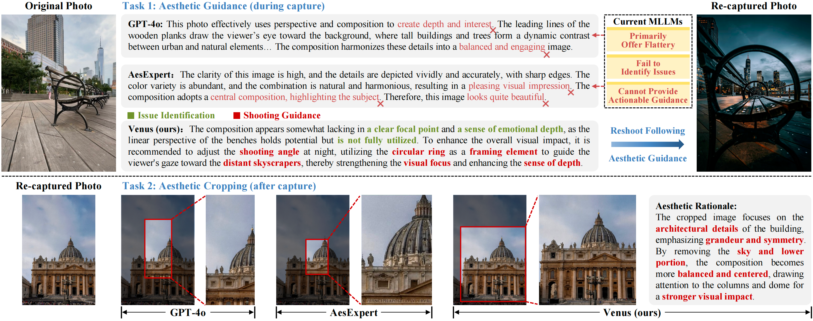
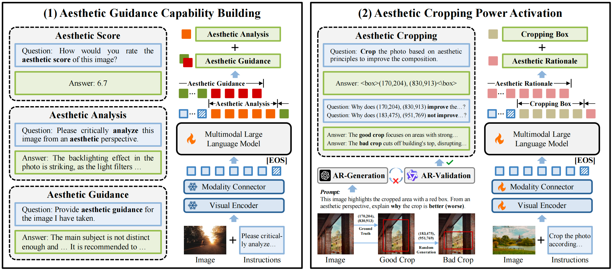

<!-- PROJECT LOGO -->

<p align="center">
  <h1 align="center">Venus: Benchmarking and Empowering Multimodal Large Language Models
for Aesthetic Guidance and Cropping</h1>
  <p align="center">
    <a href="http://39.108.48.32/mipl/news/news.php?id=EGdutianxiang"><strong>Tianxiang Du</strong></a>
    ·
    <a href="http://39.108.48.32/mipl/news/news.php?id=EGhehulingxiao"><strong>Hulingxiao He</strong></a>
    ·
    <a href="http://39.108.48.32/mipl/yuxinpeng/"><strong>Yuxin Peng</strong></a>
  </p>
  <h2 align="center">CVPR 2026</h2>
  <h3 align="center"><a href="https://arxiv.org/abs/2602.23980">Paper</a></h3>
<div align="center"></div>

## 🌟 **Motivation**
In **Aesthetic Guidance (during capture)**, existing MLLMs primarily offer flattery, fail to identify issues, and cannot provide actionable guidance. In **Aesthetic Cropping (after capture)**, Venus produces balanced and visually appealing crops with clear aesthetic rationales, whereas existing MLLMs fail to reframe effectively or offer convincing explanations.

<div align="center">

</div>

## 📖 **Dataset & Method**
We introduce **AesGuide**, the first aesthetic guidance dataset and benchmark, and propose **Venus**, a two stage framework comprising: **(1) Aesthetic guidance capability building**, where AesGuide is leveraged to empower MLLMs with AG capability, resulting in aesthetic guidance MLLMs. **(2) Aesthetic cropping power activation**, which unlocks the cropping ability of the aesthetic guidance MLLM using CoT-based rationales.

<div align="center">

</div>


## 📣 News
- [03/07/2026] We release the training code and the AesGuide dataset!
- [03/05/2026] We release the models <a href="https://huggingface.co/popo28/Venus-Q-Stage1">Venus-Q-Stage1</a> and <a href="https://huggingface.co/popo28/Venus-Q-Stage2">Venus-Q-Stage2</a>, along with the evaluation code.
- [02/21/2026] Our work is accepted to <a href="https://cvpr.thecvf.com/Conferences/2026">CVPR 2026</a> 🌼! See you in Denver this June!

## 💾 Installation

1\. Clone this repository and move to the project working directory:
```
git clone https://github.com/PKU-ICST-MIPL/Venus_CVPR2026.git
cd Venus_CVPR2026
```
2\. Create a working environment:
```
conda create -n Venus python=3.10 -y
conda activate Venus
```
3\. Install the backbone model code: 

Since we support five backbone models, we take [Qwen-VL-Chat](https://github.com/cognitedata/Qwen-VL-finetune/tree/master) as an example. Other backbones follow the same procedure.
```
git clone https://github.com/cognitedata/Qwen-VL-finetune.git
cd Qwen-VL-finetune
pip install -r requirements.txt
```

## 📦 Datasets Preparation
To download AesGuide, please sign the [Release Agreement](agreement/Release_Agreement.pdf) and send it to Tianxiang Du (tianxiangdu28@163.com). By sending the application, you are agreeing and acknowledging that you have read and understand the notice. We will reply with the file and the corresponding guidelines right after we receive your request!

After downloading, unzip and organize the directory like the following and we are ready to go:
```
Venus_CVPR2026
└── data
    ├── Benchmark_AesGuide/  # AesGuide benchmark (evaluation)
    │   ├── images/          
    │   └── json/            
    ├── Benchmark_FLMS/      # FLMS benchmark (evaluation)
    │   ├── images/
    │   └── json/
    ├── Stage1/              # Stage 1 training data
    │   ├── images/
    │   └── json/
    └── Stage2/              # Stage 2 training data
        ├── images/
        └── json/
```

## 🔥 Training
1\. Download the backbone model [Qwen-VL-Chat](https://huggingface.co/Qwen/Qwen-VL-Chat) from HuggingFace:
```
huggingface-cli download Qwen/Qwen-VL-Chat --local-dir /path/to/save/model
```
After downloading, organize the directory like the following:
```
Venus_CVPR2026
    └── pretrained_weights/
          └── Qwen-VL-Chat
```

2\. Train Venus Stage 1

Stage 1 trains the model on AesGuide together with several post-processed open-source datasets.

Copy the Stage 1 training script to `Venus_CVPR2026/Qwen-VL-finetune/finetune/`, then run it:

```
cp Venus_CVPR2026/train/train_Stage1.sh Venus_CVPR2026/Qwen-VL-finetune/finetune/
cd Venus_CVPR2026/Qwen-VL-finetune
sh finetune/train_Stage1.sh
```

3\. Train Venus Stage 2

Similarly, copy the Stage 2 training script to to `Venus_CVPR2026/Qwen-VL-finetune/finetune/`, then run it:
```
cp Venus_CVPR2026/train/train_Stage2.sh Venus_CVPR2026/Qwen-VL-finetune/finetune/
cd Venus_CVPR2026/Qwen-VL-finetune
sh finetune/train_Stage2.sh
```


## 📋 Evaluation

#### 1. Stage 1 Evaluation
We evaluate the Stage 1 aesthetic guidance capability on the AesGuide benchmark.

Step 1: Run inference
```
cd Venus_CVPR2026/evaluate/Benchmark_AesGuide
python 1_inference_on_AesGuide.py
```

Step 2: GPT-assisted scoring (three dimensions)
```
cd Venus_CVPR2026/evaluate/Benchmark_AesGuide/GPT_rate
python Completeness.py
python Preciseness.py
python Relevance.py
```

Step 3: Aggregate scores

Finally, open `calc.ipynb` to summarize and compute the final scores.

**Note.** In the paper, we used [gpt-3.5-turbo](https://aihubmix.com/model/gpt-3.5-turbo) as the evaluator through two third-party API services ([aihubmix.com](https://aihubmix.com/) and [gpt.zhizengzeng.com](https://gpt.zhizengzeng.com/)). However, these services no longer provide gpt-3.5-turbo; even when explicitly specified, the actual backend model is different (see [Fig. 1](figures/API_1.png) and [Fig. 2](figures/API_2.png)), and the exact backend mapping is not publicly documented. Therefore, we plan to adopt newer evaluator models with explicit versioning and update the repository accordingly.

#### 2. Stage 2 Evaluation

We evaluate the Stage 2 aesthetic cropping capability on the FLMS benchmark.

Step 1: Run inference
```
cd Venus_CVPR2026/evaluate/Benchmark_FLMS
python 1_inference_on_FLMS.py
```

Step 2: Extract cropping coordinates
```
python 2_turn.py
```

Step 3: Compute scores
```
python 3_calc_on_FLMS.py
```

## 🚩 Acknowledgments
Our code references [Qwen-VL-Chat](https://github.com/cognitedata/Qwen-VL-finetune/tree/master), [InternVL 2.5](https://github.com/OpenGVLab/InternVL/tree/main), [MiniCPM-V 2.6](https://github.com/cuiyuheng/MiniCPM-V), [LLaVA](https://github.com/haotian-liu/LLaVA). Many thanks to the authors.

## 🗻 Citation
Should you find our paper valuable to your work, we would greatly appreciate it if you could cite it:
```bibtex
@article{du2026venus,
  title={Venus: Benchmarking and Empowering Multimodal Large Language Models for Aesthetic Guidance and Cropping},
  author={Du, Tianxiang and He, Hulingxiao and Peng, Yuxin},
  journal={arXiv preprint arXiv:2602.23980},
  year={2026}
}
```